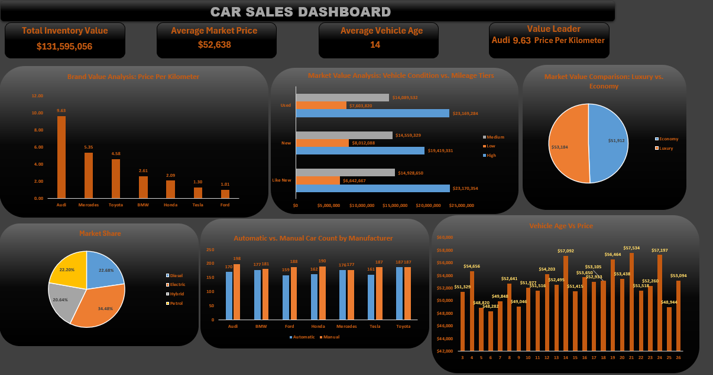

# 🚗 Automobile Market Analysis & Price Prediction Dashboard

## 📌 Project Overview
This project focuses on the comprehensive analysis of an **Automobile Price Prediction Dataset** containing over 2,500 vehicle entries. As a Data Analyst, my goal was to transform raw, synthetic data into actionable business insights through a structured ETL process and an interactive executive dashboard.

---

## 🛠️ Data Engineering & ETL Process (Power Query)
The raw data required significant cleaning to ensure high-fidelity analysis. Using **Power Query**, I performed the following operations:

* **Data Integrity Fixes:** Corrected the logical error where Tesla vehicles were incorrectly listed with "Petrol" or "Diesel" fuel types.
* **Text Standardization:** Applied trimming and cleaning to remove accidental spaces and standardize categorical values.
* **Feature Engineering:** Developed new metrics to provide deeper analytical value:
    * **Vehicle Age:** Calculated by subtracting the production year from the current year (2026).
    * **Price Per Kilometer:** Created a custom metric to measure the value-for-money of different vehicle brands.
    * **Mileage Category:** Segmented the data into **Low**, **Medium**, and **High** usage tiers for better filtering.
    * **Brand Grouping:** Categorized manufacturers into **Luxury** (Audi, BMW, Mercedes, Tesla) and **Economy** (Ford, Honda, Toyota) segments.

---

## 📊 Key Business Insights
The final analysis yielded several critical observations:
* **Value Leadership:** **Audi** emerged as the value leader with the highest average Price-per-KM at **$9.63**.
* **Market Share:** Electric vehicles represent the largest portion of the inventory at **34.48%**.
* **Operational Mix:** Analyzed the distribution of **Automatic vs. Manual** transmissions across all major brands.
* **Depreciation Trends:** Visualized the correlation between vehicle age and market valuation to identify the optimal resale window.

---

## 💻 Tech Stack & Tools
* **Microsoft Excel:** Primary tool for analysis and visualization.
* **Power Query:** Used for the ETL (Extract, Transform, Load) pipeline.
* **Pivot Tables & DAX:** Utilized for data aggregation and multi-dimensional analysis.
* **Interactive Dashboard:** Designed with dynamic slicers and a dark-mode UI for an application-like experience.

---

## 👤 About the Author
**Ahnaf Shahadat Taseen**
* **Education:** B.Sc. in Computer Science and Engineering (CSE) from **East West University**.
* **Focus:** Passionate about Data Science, SQL, and building AI-integrated applications.
* **Portfolio Goal:** To demonstrate professional-grade data auditing, feature engineering, and visualization skills.

---

### 📂 Repository Structure
* `/Data`: Contains the dataset used for analysis.
* `/Dashboard`: The final `.xlsx` file containing the Power Query steps and the interactive dashboard.
* `/ScreenShots`: High-resolution images of the dashboard interface.
